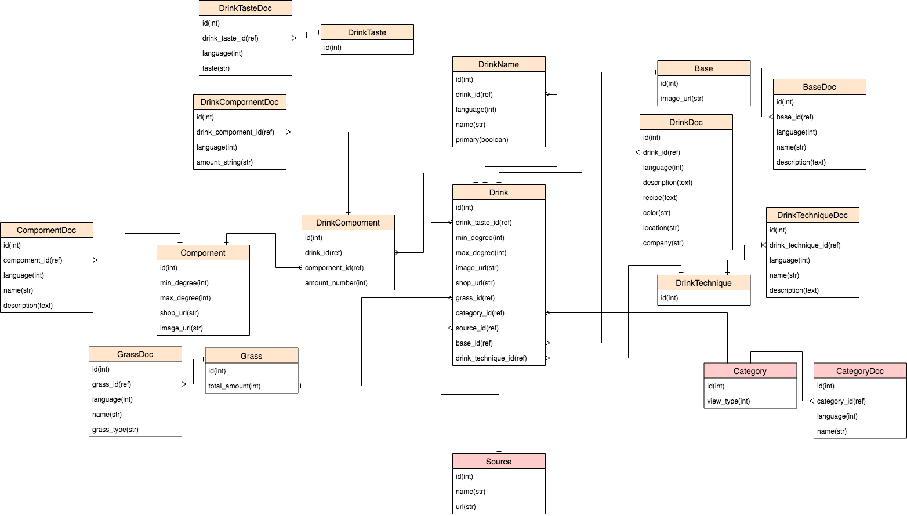

# PicMenu

## APIサーバのリポジトリ
[NG_1803_2](https://github.com/jphacks/NG_1803_2)

## 製品概要
### Menu Tech

### 背景（製品開発のきっかけ、課題等）
- 今回のプロダクト開発に至った経緯
    - 居酒屋やバーに行くと、「マルガリータ」「カミカゼ」「爆弾」など、名前を見ただけではどのようなお酒か分からないものがドリンクメニュー内に散見される。それらについて手軽に知りたいと考え、今回の開発に至る。

- 着目した顧客
    - お酒に精通していない人

- 顧客の課題
    - 「マルガリータ」「カミカゼ」「爆弾」など、居酒屋やバーのドリンクメニューには、名前を見ただけでは何か分からないものがある。

- 現状
    - メニューの情報量が少なく、どのようなお酒か分からないものがあるが、それらをいちいち調べるのは面倒。また、海外のお店では尚更メニュー内容が読めない。

### 製品説明（具体的な製品の説明）
スマートフォンで撮影されたドリンクメニューの写真がそのままUI化され、気になるお酒をタップすると詳細情報を見ることができる。また、ユーザーは飲んだお酒や気になるお酒をブックマークできたり、ユーザーにオススメのお酒が提示されたりする。さらに、複数言語対応しており、幅広いユーザー向け。

### 特長

#### 1. 写真がそのままUIに！
スマホで撮影したドリンクメニュー画像から、ドリンク名をタップするだけで、ドリンクの詳細情報が見られる

#### 2. お酒の味・度数・レシピが分かる！
知らないお酒の情報が得られることで、新たなお酒との出会いが生まれる

#### 3. オススメ機能
ユーザーへのおすすめや、お店の人気メニューを分かりやすく提示することで、自分に合ったお酒選びが可能に

#### 4. 複数言語対応
メニューや詳細情報の言語が切り替わることで、日本人が海外のお店で、また外国人が日本のお店で、様々なシーンで、幅広いユーザーが利用可能

### 解決出来ること
- 一度メニューの写真を撮るだけで、検索せずとも、気になるお酒の情報が素早く手軽に入手できる。
- さらに、海外でお店に行った際、理解できなかったメニューが翻訳されて説明も加えられることで理解可能になる。

### 今後の展望
- 飲んだお酒や気になるお酒を記録し、それを元にユーザーへのおすすめや、お店の人気メニューを提示
- 位置情報と結びつけ、撮影したメニュー画像と撮影した店を紐づけることで、店の情報も記録
- ドリンクメニューだけでなく、フードメニューにも対応

## 開発内容・開発技術
### 活用した技術
#### API・データ
* Google Cloud Vision API
* Google Translate API
* The cocktailDataBaseから取得したデータ
* カクテルレシピ - Liquor & Cocktail - サントリーから取得したデータ
* Amazonから取得した取得したデータ

#### フレームワーク・ライブラリ・モジュール
* Unity
* Ruby on Rails

#### デバイス
* スマートフォン

#### 参考論文
* 岡崎直観, 辻井潤一「高速な類似文字列検索アルゴリズム」（情報処理学会創立50周年記念全国大会）2010

### 研究内容・事前開発プロダクト（任意）
* DB設計（ER図）
* ドリンクデータの収集（Python）

### 独自開発技術（Hack Dayで開発したもの）
#### 2日間に開発した独自の機能・技術

##### クライアント
* 写真撮影（Unity）
* アニメーション（Unity）
* サーバーとの通信（Unity）

##### サーバーサイド
* Google Cloud Vision APIのOCR機能向上
* あいまい検索、類似度検索:「高速な類似文字列検索アルゴリズム」を実装したSimStringのRuby移植ライブラリ
* DB構築（ER図）
* ドリンクデータの収集（Python）
* ドリンクデータのDB形式への整形（Python）

* 特に力を入れた部分をファイルリンク、またはcommit_idを記載してください（任意）
* 想定しうる全ての情報を入れ、アルコール度数、味、材料など様々な条件で検索可能。かつ何カ国語にも対応できる様拡張性の高いデータベース設計になっている
[NG_1803_2 /db/schema.rb](https://github.com/jphacks/NG_1803_2/blob/master/db/schema.rb)
[]

* GoogleCloudVisionAPI OCRは日本語対応の他のAPIやライブラリに比べて高いが、単語や文字がかなり細かく切られて取得される傾向があったため，適切に結合する機能を実装した
[NG_1803_2 /lib/google_vision_api.rb](https://github.com/jphacks/NG_1803_2/blob/master/lib/google_vision_api.rb#L38)

* お店によると，「ファジーネーブル」「ファジー・ネーブル」などの表記揺れやOCRの誤認識に対応するために，高速なあいまい検索をライブラリを用いて実装した
[NG_1803_2 /controllers/menu_images_controller.rb](https://github.com/jphacks/NG_1803_2/blob/master/app/controllers/menu_images_controller.rb#L72)
